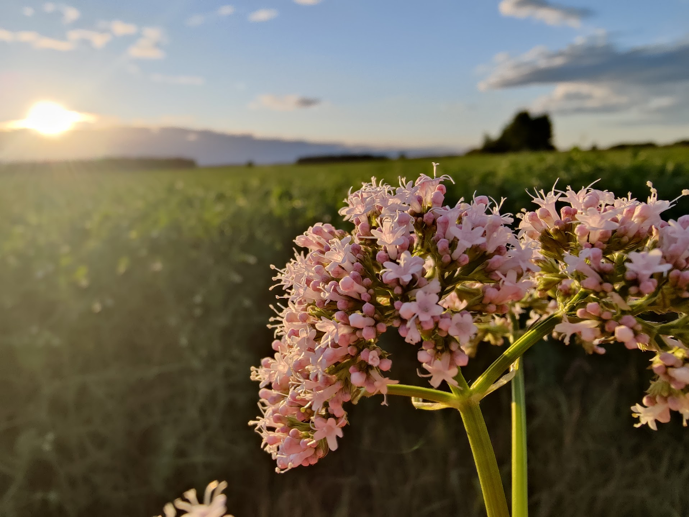
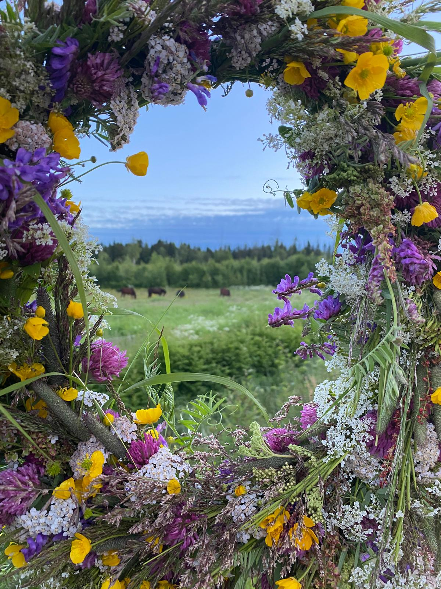

## Galleria

Kuvia yhdistyksemme tapahtumista ja kylältä. Jos haluat kuvasi tänne, ota yhteyttä puheenjohtajaan!

### Kyläkuvat

  

    
    
Peltomaisemaa

  

  

    
    
Maisemaa seppeleen läpi

  

<!-- Lightbox container -->

  &times;
  

---

*Kaikki kuvat © Ketunmaan - Selkäsenkylän kyläyhdistys ry*
