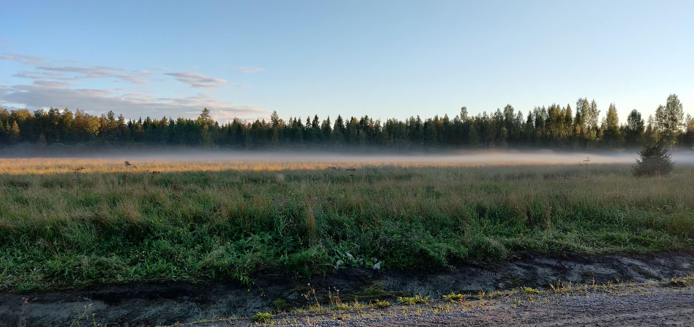

  

## Tervetuloa Ketunmaahan!
Ketunmaa on Limingan kunnassa sijaitseva kylä, joka sijaitsee noin viiden kilometrin päästä kunnan keskustasta etelään. [Wikipedia](https://fi.wikipedia.org/wiki/Ketunmaa)

Ketunmaan - Selkäsenkylän kyläyhdistys ry on yhdistys, jonka tarkoitus on edistää kylän asukkaiden yhteisöllisyyttä ja viihtyvyyttä. 
Järjestämme joka vuosi perinteiset Piippuhiihot ja lisäksi kehitämme kyläläisten yhteistä toimintaa.

### Ajankohtaista

  <h3>Luistelukentän valoista</h3>
  
<b>Kunnasta tuli viestiä, että luistelukentän valojen ohjaukseen ei saa mennä itse koskemaan sähköturvallisuussyistä.
     Jos valoja ei sammuta, ne palavat niin kauan että ne joku muu sammuttaa. Muistetaanpa tämä - ja kerrotaan asiasta myös kavereille!</b>
  

  
📅 18:00 - 20:00 23.2.2026

  <h3>Hallituksen kevätkokous</h3>
  
Järjestetään hallituksen kevätkokous Limingan kirjaston 2krs monitoimiluokassa. Kaikki yhdistyksen toiminnasta kiinnostuneet ovat tervetulleita paikalle!

  
📅 22.3.2026

  <h3>Piippuhiihot</h3>
  
Perinteinen talvitapahtumamme järjestetään Limingan rantakylän hiihtostadionilla. Kaikki ovat tervetulleita talvitapahtumaan!
    Hiihtokisoihin voivat osallistua kaikki ketunmaalla syntyneet, ketunmaalle muuttaneet tai ketunmaalaisen puolison hankkineet : )
    Ohjelmassa hiihtokisojen lisäksi arvontaa, onnenpyörää ja paikalta voi ostaa lämpimät makkarat ja juomat.
    Maksuksi käy mobilepay tai käteinen.

  
📅 xx.x.2026

  <h3>Kevätsiivous</h3>
  
Siivotaan yhdessä luistelukentän alue kuntoon! Mukaan harava ja jätesäkkejä! Kahvitarjoilu.

### Liity jäseneksi!

  <h3>🤝 Yhteisöllisyys</h3>
  
Tapaa naapurisi ja ole mukana rakentamassa elinvoimaista kyläyhteisöä.

  <h3>🎉 Tapahtumat</h3>
  
Pääset mukaan monipuolisiin tapahtumiin ympäri vuoden - kesäjuhlista talvitapahtumiin.

  <h3>💬 Vaikutusmahdollisuus</h3>
  
Vaikuta kylän kehittämiseen ja tuo esiin omia ideoitasi.

---

*Seuraa meitä [Facebookissa](https://www.facebook.com/groups/1517350081891194) ja pysy ajan tasalla yhdistyksen toiminnasta!*
